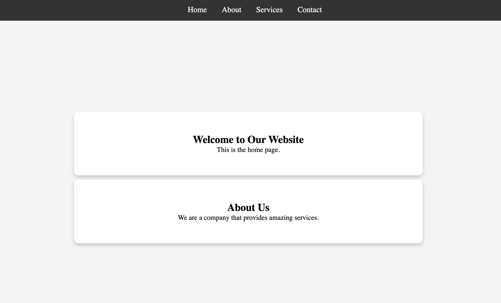

## 📜 HTML Structure
| HTML Tag | Purpose |
|----------|---------|
| `<nav>` | Holds the navigation menu. |
| `<a href="#id">` | Links to different sections (simulating page navigation). |
| `
` | Wraps all sections for styling. |
| `<section id="page">` | Defines each "page" in the multi-page experience. |

## 🎨 CSS Features Used
| CSS Feature | Purpose |
|------------|---------|
| `:target` | Shows the selected section and hides others. |
| `display: none / block` | Hides inactive sections and displays the active one. |
| `transition` | Enables smooth animations when switching sections. |
| `position: fixed` | Keeps the navigation bar at the top of the screen. |
| `@keyframes fadeIn` | Animates the page transition effect. |
| `flexbox / grid` | Creates a responsive and structured layout. |

## Desktop Preview

