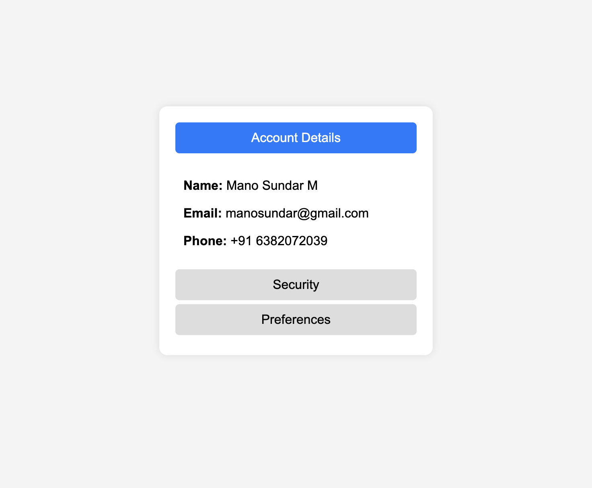

- `<input type="radio">`: Used to create hidden radio buttons for tab selection  
- `<label>`: Acts as the clickable tab that controls which content is displayed  
- `
`: Holds the content of each tab  

- `display: none;`: Hides all content sections by default  
- `:checked + .tab-label + .tab-content`: Shows the content of the selected tab  
- `transition: opacity 0.3s ease-in-out;`: Adds a smooth effect when switching tabs  
- `cursor: pointer;`: Makes labels behave like clickable tabs  
- `background-color`: Changes tab background color when selected  

 
1. Each tab has a corresponding **radio button** that remains hidden.  
2. Clicking a **label** selects the associated radio button.  
3. The `:checked` pseudo-class ensures that only the selected tab's content is visible.  

## Desktop Preview
