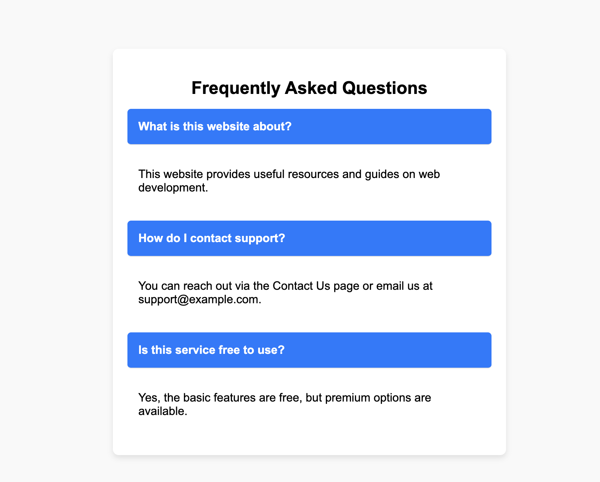

- **`<input type="checkbox">`** → Hidden checkboxes control the open/close state.
- **`<label>`** → Acts as a clickable button to toggle the corresponding answer.
- **`
`** → Contains the answer, which expands/collapses based on user interaction.
- **`
`** → Main container for the FAQ section.

---

- **Hiding checkboxes (`display: none;`)** → Used to store toggle state without showing them.
- **Clickable Labels (`cursor: pointer;`)** → Styled to look like expandable headers.
- **Accordion Animation (`max-height & transition`)** → Smooth expand/collapse effect.
- **`:checked` Pseudo-class** → Controls when the answer section becomes visible.

---

1. The **label** is linked to a hidden checkbox.
2. When the **label** is clicked, the checkbox gets **checked**.
3. The `:checked` CSS selector **triggers the answer** to expand.
4. CSS **smoothly animates** the transition.

## Desktop Preview

