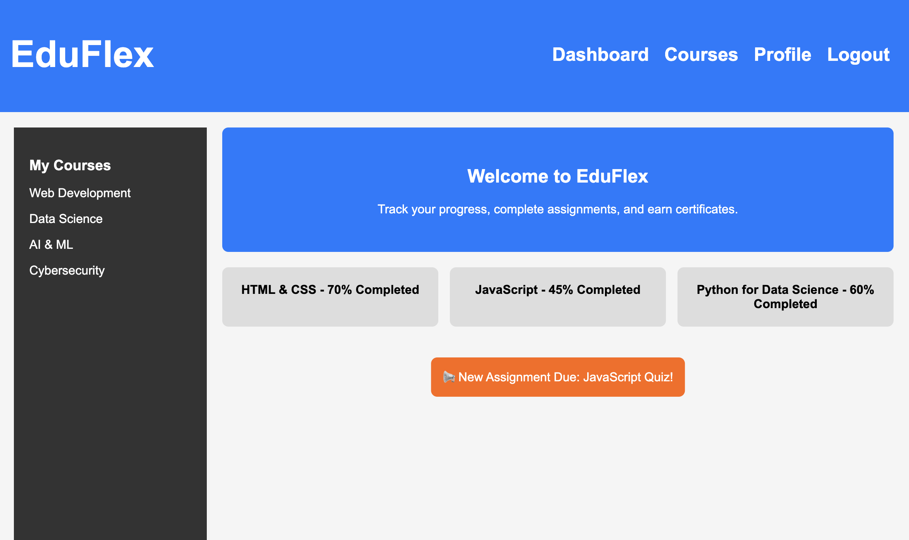

=
- `<header>`: Defines the sticky navigation bar.  
- `<nav>`: Contains the menu links.  
- `<aside>`: Sidebar for course categories.  
- `<main>`: Holds the primary course content.  
- `<section>`: Groups related content like courses and notifications.  
- `<footer>`: Displays the copyright notice.  

- `display: grid;` → Creates a **two-column layout** (sidebar + content).  
- `display: flex;` → Aligns **course cards** in a row.  
- `position: sticky;` → Keeps the **header & sidebar** visible while scrolling.  
- `position: absolute;` → Overlaps the **notification box** over the content.  
- `@media (max-width: 768px)` → Makes the layout **responsive for mobile**. 

## Desktop Preview
